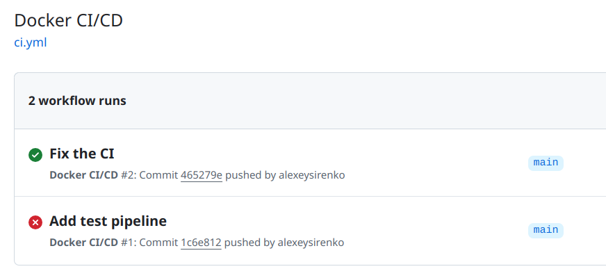
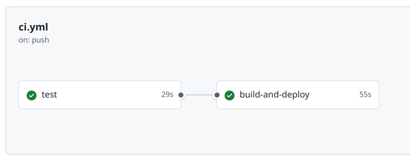
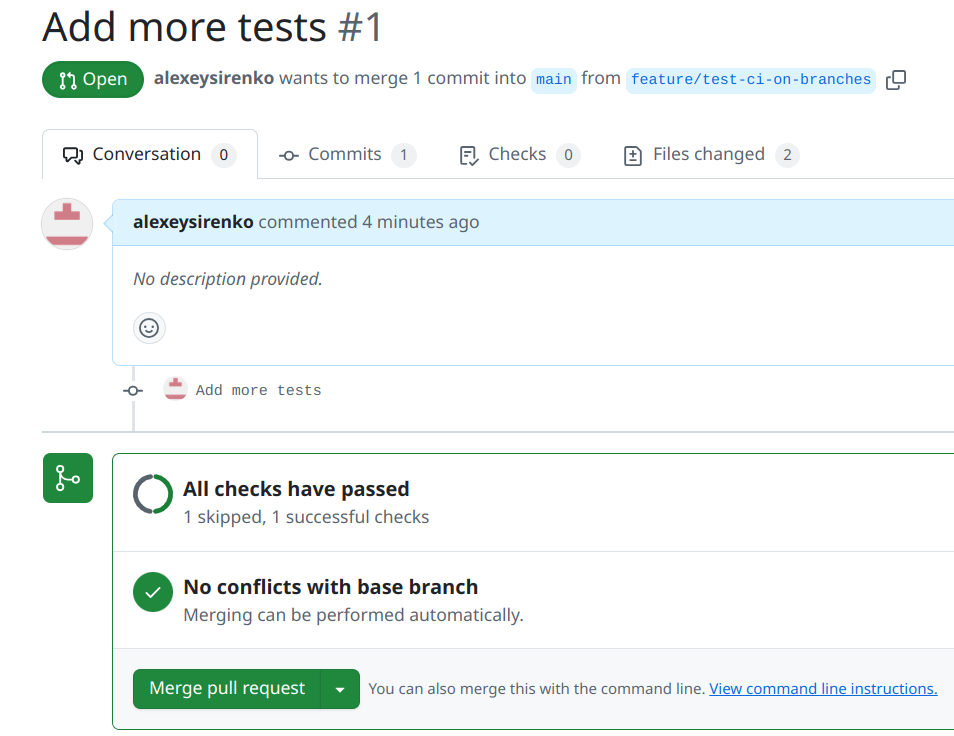

# prjctr-23-ci

Hello world app with Github CI setup (docker version)

## Works on the main branch

## Works on pull requests

## Pushes images to GHCR

[ghcr.io/alexeysirenko/prjctr-23-ci/my-image](ghcr.io/alexeysirenko/prjctr-23-ci/my-image)
